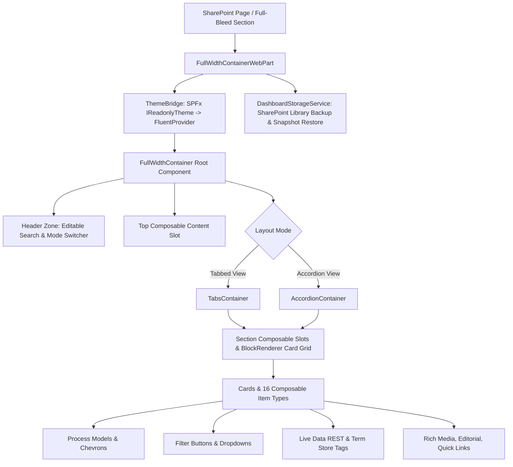

# SPFx Full-Width Container Web Part


## Summary

**spfx-fullwidth-container** is an enterprise-grade SharePoint Framework (SPFx) client-side web part engineered for modern SharePoint Online Communication and Team Sites. Designed to sit in a modern SharePoint full-bleed column (`supportsFullBleed: true`), it provides an interactive, highly customizable dashboard container capable of toggling dynamically between **Tabbed View** and **Accordion View** layouts.

The solution is built 100% on **Microsoft Fluent UI 2** (`@fluentui/react-components`), leveraging Griffel CSS-in-JS design tokens, native SharePoint theme synchronization via `ThemeBridge`, Turner & Townsend corporate brand palettes, interactive WYSIWYG canvas editing, live data REST integration, SharePoint Global Term Store taxonomy filters, and a resilient document library backup/restore mechanism.

---

## Architectural Highlights



- **Native Theme Inheritance:** SPFx theme variants and semantic colors are bridged dynamically to Fluent UI 2 theme tokens (`webLightTheme` / `webDarkTheme`) via [`ThemeBridge`](src/webparts/fullWidthContainer/utils/themeBridge.ts).
- **Dual Layout Engines:** Switch on the fly between tabbed navigation (`TabList` / `Tab`) and collapsible accordions (`Accordion` / `AccordionItem`) with bulk Expand/Collapse controls.
- **Composable Content Hierarchies:** Three tiers of authoring slots:
  1. Top-of-Dashboard Header Slot
  2. Top-of-Section Banner Slots
  3. Inner Card Composable Item Stacks
- **Canvas Drag Isolation:** Deep event suppression preventing the SharePoint Online Canvas Move Web Part controller from capturing drag handles during card boundary resizing or text selection.
- **Self-Contained Library Persistence:** Backs up dashboard snapshots, templates, and schemas directly to the tenant's `Dashboards` SharePoint document library (`/Dashboards/Backups` and `/Dashboards/Templates`) with automatic library provisioning prompts and direct root REST upload fallbacks.

---

## Registered Features (`feature.JSON`)

The web part implements 38 discrete architectural features tracked across the Triple Registry:

| Feature ID | Feature Name | Description | Key Modules |
| :--- | :--- | :--- | :--- |
| **FEAT-001** | FullBleedLayout | Native `supportsFullBleed` modern SharePoint section column integration. | [`FullWidthContainerWebPart.manifest.json`](src/webparts/fullWidthContainer/FullWidthContainerWebPart.manifest.json) |
| **FEAT-002** | DualLayoutModes | Dynamic toggle between Tabbed View (pill/underline) and Accordion View (collapsible panels). | [`FullWidthContainer.tsx`](src/webparts/fullWidthContainer/components/FullWidthContainer.tsx), [`TabsContainer.tsx`](src/webparts/fullWidthContainer/components/TabsContainer.tsx), [`AccordionContainer.tsx`](src/webparts/fullWidthContainer/components/AccordionContainer.tsx) |
| **FEAT-003** | ChildContentBlocks | Configurable child slots: Rich Cards, Embed/iFrame tools, British Metric Stats (£), and Quick Links. | [`BlockRenderer.tsx`](src/webparts/fullWidthContainer/components/BlockRenderer.tsx), [`IContainerModels.ts`](src/webparts/fullWidthContainer/models/IContainerModels.ts) |
| **FEAT-004** | FluentUI2DesignSystem | 100% Microsoft Fluent UI 2 design tokens, Griffel CSS, and theme-adaptive surfaces. | [`themeBridge.ts`](src/webparts/fullWidthContainer/utils/themeBridge.ts), [`ComponentStyleRules.JSON`](ComponentStyleRules.JSON) |
| **FEAT-005** | PropertyPaneCustomisation | 3-page interactive properties pane for layout, sections, badges, metrics, cards, and presets. | [`FullWidthContainerWebPart.ts`](src/webparts/fullWidthContainer/FullWidthContainerWebPart.ts) |
| **FEAT-006** | InlineCanvasAndCardEditing | In-place WYSIWYG canvas authoring for container titles, card subtitles, descriptions, and metric badges. | [`RichTextEditable.tsx`](src/webparts/fullWidthContainer/components/RichTextEditable.tsx), [`FloatingTextToolbar.tsx`](src/webparts/fullWidthContainer/components/FloatingTextToolbar.tsx) |
| **FEAT-007** | ComposableInnerCardsAndHoverToolbox | Hover (+) insertion bars and toolbox popovers for adding modular items inside cards. | [`InsertionBar.tsx`](src/webparts/fullWidthContainer/components/InsertionBar.tsx), [`ToolboxModal.tsx`](src/webparts/fullWidthContainer/components/ToolboxModal.tsx) |
| **FEAT-008** | SharePointGlobalTermStoreIntegration | Taxonomy service integration rendering interactive managed metadata tag pills from SharePoint Term Store. | [`TaxonomyService.ts`](src/webparts/fullWidthContainer/services/TaxonomyService.ts), [`TermStorePicker.tsx`](src/webparts/fullWidthContainer/components/TermStorePicker.tsx) |
| **FEAT-009** | LiveDataAPIFields | Dynamic real-time text and metric fields bound to REST/Graph APIs with JSONPath parsing and refresh timers. | [`LiveDataService.ts`](src/webparts/fullWidthContainer/services/LiveDataService.ts), [`LiveDataRenderer.tsx`](src/webparts/fullWidthContainer/components/LiveDataRenderer.tsx) |
| **FEAT-010** | CardGridSpanningAndContainerLayout | CSS Grid spanning (1-4 columns, 1-2 rows) and container column management (1-4 columns or auto-fit). | [`BlockRenderer.tsx`](src/webparts/fullWidthContainer/components/BlockRenderer.tsx), [`TabsContainer.tsx`](src/webparts/fullWidthContainer/components/TabsContainer.tsx) |
| **FEAT-011** | IndependentCardHeightAndEqualRowScaling | Flexible card height scaling supporting both `fit-content` and row-equalized height matching. | [`BlockRenderer.tsx`](src/webparts/fullWidthContainer/components/BlockRenderer.tsx), [`CardEditDialog.tsx`](src/webparts/fullWidthContainer/components/CardEditDialog.tsx) |
| **FEAT-012** | FluentUI2SkeletonShimmers | Fluent UI 2 Skeleton pulse shimmers replacing layout shifts during async taxonomy and REST queries. | [`LiveDataRenderer.tsx`](src/webparts/fullWidthContainer/components/LiveDataRenderer.tsx), [`TermStorePicker.tsx`](src/webparts/fullWidthContainer/components/TermStorePicker.tsx) |
| **FEAT-013** | FluentUI2ToastNotifications | Non-intrusive toast notification system for resize boundaries, JSON actions, and save confirmations. | `preview/index.html` |
| **FEAT-014** | DashboardJSONPortability | Complete dashboard template export and import via Property Pane for cross-site template replication. | [`FullWidthContainerWebPart.ts`](src/webparts/fullWidthContainer/FullWidthContainerWebPart.ts) |
| **FEAT-015** | TurnerAndTownsendBrandPaletteAndIndependentBackgrounds | Official Turner & Townsend July 2025 brand palettes and independent canvas, section, and card color controls. | [`BrandColorPickerPopover.tsx`](src/webparts/fullWidthContainer/components/BrandColorPickerPopover.tsx) |
| **FEAT-016** | LivePhysicalCardResizePreviewAndSharePointMoveIsolation | Live physical dimension preview badge during resizing with complete drag-event isolation from SharePoint Online. | [`dragIsolation.ts`](src/webparts/fullWidthContainer/utils/dragIsolation.ts), [`BlockRenderer.tsx`](src/webparts/fullWidthContainer/components/BlockRenderer.tsx) |
| **FEAT-017** | MiniCollapsibleCardTags | Collapsible mini tag badge on cards expanding interactively into full tag pill clouds. | [`BlockRenderer.tsx`](src/webparts/fullWidthContainer/components/BlockRenderer.tsx) |
| **FEAT-018** | VisualBrandColorPopovers | Visual palette popover with categorized brand swatches, active selection rings, and custom HEX input. | [`BrandColorPickerPopover.tsx`](src/webparts/fullWidthContainer/components/BrandColorPickerPopover.tsx) |
| **FEAT-019** | SharePointDocumentLibraryBackupAndRestore | Automatic versioned snapshot backup and restore targeting SharePoint Document Library (`Dashboards`). | [`DashboardStorageService.ts`](src/webparts/fullWidthContainer/services/DashboardStorageService.ts) |
| **FEAT-020** | CustomBrandSVGIconsAndDynamicIconStyling | Corporate SVG icon registry with independent glyph color and tinted background container styling. | [`CustomSvgIconRegistry.tsx`](src/webparts/fullWidthContainer/components/CustomSvgIconRegistry.tsx) |
| **FEAT-021** | PropertyPaneAccordionAndVisualIconField | Accordion layout across all 3 property pane pages with visual 24px icon preview launchers. | [`PropertyPaneIconField.tsx`](src/webparts/fullWidthContainer/components/PropertyPaneIconField.tsx) |
| **FEAT-022** | SharePointDocumentLibraryDirectRESTFix | Resilient URL slash handling and hierarchical folder resolution for SharePoint Online REST endpoints. | [`DashboardStorageService.ts`](src/webparts/fullWidthContainer/services/DashboardStorageService.ts) |
| **FEAT-023** | UniversalSvgIconStylingAndTransparentColorPicker | Full library of 224 corporate Turner & Townsend SVG icons with transparent background support. | [`TtSvgIconCollection.ts`](src/webparts/fullWidthContainer/components/TtSvgIconCollection.ts) |
| **FEAT-024** | SectionActionIconsAndUnblurredCanvasPanels | Inline edit/delete action buttons for section headers paired with transparent, unblurred modal panels. | [`SectionEditDialog.tsx`](src/webparts/fullWidthContainer/components/SectionEditDialog.tsx) |
| **FEAT-025** | ContextualDefaultColorOptionsAcrossPickers | Dedicated contextual default swatches accurately representing transparent, brand cyan, soft tint, and dark text. | [`BrandColorPickerPopover.tsx`](src/webparts/fullWidthContainer/components/BrandColorPickerPopover.tsx) |
| **FEAT-026** | DualModeRichTextFormatting | Contextual formatting ribbons applying to highlighted selections or the entire text block when unselected. | [`RichTextEditable.tsx`](src/webparts/fullWidthContainer/components/RichTextEditable.tsx) |
| **FEAT-027** | ResilientSharePointLibrarySnapshotUpload | Multi-tier REST backup with automatic root library upload fallback when folder creation is restricted. | [`DashboardStorageService.ts`](src/webparts/fullWidthContainer/services/DashboardStorageService.ts) |
| **FEAT-028** | UnclippedFloatingTextToolbarAndCardTypography | Portal-rendered formatting ribbons escaping card overflow boundaries with full typography customization. | [`FloatingTextToolbar.tsx`](src/webparts/fullWidthContainer/components/FloatingTextToolbar.tsx) |
| **FEAT-029** | ContextualItemPropertyEditor | Dedicated modal property editor for all inner card item types with real-time live canvas syncing. | [`CardItemPropertyEditor.tsx`](src/webparts/fullWidthContainer/components/CardItemPropertyEditor.tsx) |
| **FEAT-030** | GlobalTermStoreDropdownFilters | Configurable Term Store taxonomy dropdown filters in header controls bar with active summary pills. | [`TermFilterBar.tsx`](src/webparts/fullWidthContainer/components/TermFilterBar.tsx), [`TermFilterConfigDialog.tsx`](src/webparts/fullWidthContainer/components/TermFilterConfigDialog.tsx) |
| **FEAT-031** | FilterButtonsAndProcessModel | Composable pill button filters and horizontal connected process chevron stages with capability badges. | [`FilterButtonsRenderer.tsx`](src/webparts/fullWidthContainer/components/FilterButtonsRenderer.tsx), [`ProcessModelRenderer.tsx`](src/webparts/fullWidthContainer/components/ProcessModelRenderer.tsx) |
| **FEAT-032** | TransparentCardLayoutContainer | Chrome-free transparent cards acting as boundaryless layout containers with edit-mode dashed outlines. | [`BlockRenderer.tsx`](src/webparts/fullWidthContainer/components/BlockRenderer.tsx) |
| **FEAT-033** | ComposableHeaderAndSectionContent | Composable slots at dashboard top and section top supporting left/centre/right alignment. | [`ComposableContentSection.tsx`](src/webparts/fullWidthContainer/components/ComposableContentSection.tsx) |
| **FEAT-034** | FloatingTextToolbarFocusDismissalAndSubSurfacePreservation | Smart focus-managed formatting ribbon lifecycle dismissing on outside click and preserving dropdown focus. | [`FloatingTextToolbar.tsx`](src/webparts/fullWidthContainer/components/FloatingTextToolbar.tsx) |
| **FEAT-035** | SearchBarTopRightRelocationWithEditablePlaceholder | Search bar positioned in top-right header with in-place editable placeholder via Fluent UI 2 popover. | [`FullWidthContainer.tsx`](src/webparts/fullWidthContainer/components/FullWidthContainer.tsx) |
| **FEAT-036** | DropdownFilterComposableContentItem | Dropdown filter composable item supporting term store terms or custom reorderable static options. | [`CardItemPropertyEditor.tsx`](src/webparts/fullWidthContainer/components/CardItemPropertyEditor.tsx) |
| **FEAT-037** | UserProfileDiagnosticsInspection | Author-only diagnostics inspection popover displaying `pageContext.user` properties during edit mode. | [`FullWidthContainer.tsx`](src/webparts/fullWidthContainer/components/FullWidthContainer.tsx) |
| **FEAT-038** | ProcessModelConfigurationOverhaulAndComposableDropdownFilterPane | Process model modal overhaul (pinned sticky footer, rich text stage editor, action switcher) and dropdown filter pane. | [`CardItemPropertyEditor.tsx`](src/webparts/fullWidthContainer/components/CardItemPropertyEditor.tsx), [`ProcessModelRenderer.tsx`](src/webparts/fullWidthContainer/components/ProcessModelRenderer.tsx) |

---

## Supported Composable Item Types

Authors can compose dashboards using 16 distinct modular items:

1. **Text (`text`):** Rich formatted paragraphs and typography blocks.
2. **Button (`button`):** Standard and primary action triggers.
3. **Call to Action (`cta`):** Highlighted action banners with accent backgrounds.
4. **Divider (`divider`):** Clean content separators with margin control.
5. **Editorial (`editorial`):** Styled callout quote and executive note blocks.
6. **Hero (`hero`):** High-impact banner with heading, caption, and background.
7. **Image (`image`):** Single image with caption and aspect ratio management.
8. **Gallery (`gallery`):** Multi-image thumbnail grid.
9. **Link (`link`):** Hyperlink anchor with custom icon.
10. **Quick Links (`quickLinks`):** Grouped navigation links with directional icons.
11. **Video (`video`):** Video player and Stream / YouTube / MP4 embed slot.
12. **Live Data (`liveData`):** REST API connected KPI metrics with auto-refresh and British currency (£) support.
13. **Term Store Tags (`termStoreTags`):** Interactive metadata tag pills connected to SharePoint Term Store.
14. **Filter Buttons (`filterButtons`):** Active pill filter buttons dispatching card filtering events across the dashboard.
15. **Process Model (`processModel`):** Interlocking chevron stage flow with rich stage descriptions, capability badges, and stage filtering/linking.
16. **Dropdown Filter (`dropdown`):** Dropdown filter component supporting Term Store taxonomy or reorderable static options.

---

## Project Structure & Key Modules (`ProjectStructure.JSON`)

```
spfx-fullwidth-container/
├── config/                                    # SPFx build, bundle, and deployment configurations
├── preview/                                   # Standalone browser test harness with live data mocks
│   ├── index.html                             # Full interactive dashboard preview
│   └── tt_icons.js                            # Standalone corporate SVG icon bundle
├── scripts/                                   # Automation and icon compilation scripts
├── src/
│   ├── global.d.ts                            # Global TypeScript declarations
│   └── webparts/fullWidthContainer/
│       ├── FullWidthContainerWebPart.manifest.json  # SPFx Web Part manifest (supportsFullBleed)
│       ├── FullWidthContainerWebPart.ts             # Web Part entry point and Property Pane manager
│       ├── components/                              # React 17 + Fluent UI 2 component hierarchy
│       │   ├── AccordionContainer.tsx               # Collapsible accordion layout mode
│       │   ├── BlockRenderer.tsx                    # Card rendering, metrics, grid spanning, tags
│       │   ├── BrandColorPickerPopover.tsx          # T&T brand palette color picker
│       │   ├── CardEditDialog.tsx                   # Modal dialog for card properties & styling
│       │   ├── CardItemPropertyEditor.tsx           # Contextual editor for 16 composable items
│       │   ├── ComposableContentSection.tsx         # Header & section composable content zones
│       │   ├── CustomSvgIconRegistry.tsx            # Unified SVG icon renderer
│       │   ├── ErrorBoundary.tsx                    # React runtime error boundary wrapper
│       │   ├── FilterButtonsRenderer.tsx            # Composable interactive pill filter buttons
│       │   ├── FloatingTextToolbar.tsx              # Portal-rendered rich text formatting ribbon
│       │   ├── FluentAssetExplorerDialog.tsx        # File & document asset picker dialog
│       │   ├── FluentIconPicker.tsx                 # Searchable Fluent & corporate icon picker
│       │   ├── FullWidthContainer.tsx               # Root container, layout router & search
│       │   ├── IFullWidthContainerProps.ts          # Props interface contracts
│       │   ├── InsertionBar.tsx                     # Hover (+) insertion bar
│       │   ├── LiveDataRenderer.tsx                 # Real-time REST KPI stats & shimmers
│       │   ├── ProcessModelRenderer.tsx             # Chevron process flow diagram renderer
│       │   ├── PropertyPaneIconField.tsx            # SPFx Property Pane custom icon field
│       │   ├── RichTextEditable.tsx                 # In-place WYSIWYG text surface
│       │   ├── SectionEditDialog.tsx                # Section title, icon, and background panel
│       │   ├── TabsContainer.tsx                    # Tabbed navigation layout mode
│       │   ├── TermFilterBar.tsx                    # Header taxonomy dropdown filter bar
│       │   ├── TermFilterConfigDialog.tsx           # Authoring dialog for taxonomy filters
│       │   ├── TermStorePicker.tsx                  # SharePoint Term Store taxonomy picker
│       │   ├── ToolboxModal.tsx                     # Content item catalog modal
│       │   └── TtSvgIconCollection.ts               # 224 Corporate Turner & Townsend SVG icons
│       ├── loc/                                     # Localisation strings
│       ├── models/
│       │   └── IContainerModels.ts                  # TypeScript interfaces and default UK data
│       ├── services/
│       │   ├── DashboardStorageService.ts           # SharePoint Document Library backup & restore
│       │   ├── IAssetPickerService.ts               # Asset picker interface
│       │   ├── LiveDataService.ts                   # REST API execution & JSONPath extractor
│       │   ├── SharePointAssetPickerService.ts      # SharePoint asset picker implementation
│       │   └── TaxonomyService.ts                   # SharePoint Term Store taxonomy service
│       └── utils/
│           ├── dragIsolation.ts                     # Canvas Move Web Part drag isolation
│           └── themeBridge.ts                       # SPFx to Fluent UI 2 theme token mapper
├── ComponentStyleRules.JSON                   # Design system and CSS token guidelines
├── DECISIONS.md                               # Architectural decision records (ADRs)
├── feature.JSON                               # Triple Registry: 38 registered features
├── ProjectStructure.JSON                      # Triple Registry: Component structure and roles
├── TASK_LIST.md                               # Lifecycle task tracker with timestamps
└── TEST_PLAN.md                               # Verification matrix, scenarios, and invariants
```

---

## Development Setup & Commands

### Prerequisites
- Node.js LTS (v18.x recommended for SPFx v1.23)
- Modern browser (Edge, Chrome, Firefox)
- Microsoft 365 Developer Tenant or SharePoint Online site collection

### Installation
```bash
# Clone the repository
git clone https://github.com/turner-and-townsend/spfx-fullwidth-container.git
cd spfx-fullwidth-container

# Install dependencies
npm install
```

### Build & Test Commands
```bash
# Run local standalone preview (fastest feedback loop)
# Open preview/index.html in your browser or run a local static server:
npx serve .

# Run type check across all TypeScript modules
npx tsc --noEmit

# Heft SPFx development build
npm run build

# Heft bundle for deployment packaging
npm run bundle

# Package solution for SharePoint App Catalog (.sppkg)
npm run package-solution
```

The resulting package will be generated at [`sharepoint/solution/spfx-fullwidth-container.sppkg`](sharepoint/solution/spfx-fullwidth-container.sppkg) for upload into the SharePoint Tenant App Catalog.

---

## Governance & Quality Protocols

Development in this repository strictly adheres to the following protocols:
- **Triple Registry Synchronization:** Every new feature or architectural refactor simultaneously updates [`feature.JSON`](feature.JSON), [`ProjectStructure.JSON`](ProjectStructure.JSON), and [`TEST_PLAN.md`](TEST_PLAN.md).
- **Task Lifecycle Management:** All development milestones and status shifts are tracked in [`TASK_LIST.md`](TASK_LIST.md) with `DD/MM/YYYY HH:mm` timestamps.
- **Defensive Engineering Invariants:** All DOM portals, async intervals, and window listeners implement rigorous cleanup routines documented in Section 3 of [`TEST_PLAN.md`](TEST_PLAN.md).