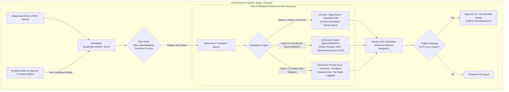

# Enterprise In-Browser Translation Architecture for Modern SharePoint

## Executive Summary

This specification outlines the technical design for a browser-level or SPFx-level translation solution for modern SharePoint Online pages. The architecture ensures:
1. **Zero External Data Exfiltration:** Intranet content remains within local client memory or enterprise tenant boundaries, with no plaintext data transmitted to public consumer translation APIs.
2. **Non-Destructive DOM Manipulation:** Direct text-node mutations that preserve React virtual DOM fiber references, preventing SharePoint runtime exceptions (`Minified React error #418`, `#423`) and maintaining interactive web part event listeners.
3. **Middle Eastern RTL & Bidirectional Formatting:** Automatic conversion from Left-to-Right (LTR) to Right-to-Left (RTL) layouts with isolated bidirectional styling, logical CSS properties, and directional component mirroring.

---

## Architectural Visualization


*Standalone vector image available at [`docs/browser-translation-architecture.svg`](docs/browser-translation-architecture.svg:1).*

### Mermaid Flowchart Definition



---

## 1. Zero-Exfiltration Privacy Architecture (Sensitive Data Protection)

Intranet and dashboard data must never be transmitted to public cloud translation endpoints (such as public Google Translate, DeepL, or external cloud engines). Three compliant architectures exist:

### Option A: Built-in Chromium On-Device Translation API (Recommended for Modern Edge/Chrome)
- Modern Chromium platforms (Microsoft Edge and Google Chrome) provide native on-device translation APIs (`window.translation`).
- Translation models and language packs (e.g., English $\leftrightarrow$ Arabic) are downloaded once to the local operating system and run on the client device's GPU/NPU.
- **Data Boundary:** Zero network packets leave the device during translation execution.

### Option B: Client-Side WebAssembly / WebGPU In-Browser Small Language Models (SLMs)
- Executes quantized multilingual translation models (such as Meta's `NLLB-200-distilled-600M` 4-bit or `MarianMT`) client-side inside the browser using `@xenova/transformers` and `onnxruntime-web`.
- Execution runs entirely within the browser's sandboxed memory using WebAssembly or WebGPU compute shaders.
- **Data Boundary:** Fully air-gapped once initial model weights are cached in browser IndexedDB storage.

### Option C: Enterprise Private Endpoint / Self-Hosted Intranet Container
- For low-powered client devices that cannot host on-device models, requests route strictly to an internal corporate network service:
  - An internal Docker container (e.g., LibreTranslate, Argos Translate, or self-hosted vLLM) hosted on corporate servers.
  - An Azure AI Translator instance configured with **Private Endpoints / Virtual Network (VNet)** and **No-Trace Data Logging** enabled, ensuring tenant boundary compliance.

---

## 2. SharePoint DOM Stability (Non-Destructive Mutation)

Standard consumer translation extensions replace entire HTML blocks (`element.innerHTML = translatedText`), which destroys React virtual DOM pointers, detaches event listeners, and causes fatal crashes across SharePoint command bars and SPFx web parts.

### A. Non-Destructive Leaf Text Node Traversal
Only mutate leaf text nodes via `document.createTreeWalker()` using `NodeFilter.SHOW_TEXT`:

```typescript
const walker = document.createTreeWalker(
  rootElement,
  NodeFilter.SHOW_TEXT,
  {
    acceptNode: (node: Node) => {
      const parent = node.parentElement;
      if (!parent) return NodeFilter.FILTER_REJECT;

      // Critical: Exclude editable zones, script/styles, and SharePoint chrome
      if (
        parent.closest('[contenteditable="true"]') ||
        parent.closest('input, textarea, select') ||
        parent.closest('#SuiteNavWrapper') || // SharePoint top bar
        parent.closest('.spfx-property-pane') || // Edit mode pane
        parent.tagName === 'SCRIPT' ||
        parent.tagName === 'STYLE'
      ) {
        return NodeFilter.FILTER_REJECT;
      }
      return NodeFilter.FILTER_ACCEPT;
    }
  }
);

let textNode: Node | null;
while ((textNode = walker.nextNode())) {
  // Mutating nodeValue updates visible text without unmounting the React DOM node
  textNode.nodeValue = translateTextLocally(textNode.nodeValue);
}
```

### B. Recursive Mutation Loop Protection
SharePoint dynamically renders content as users scroll (virtualised lists, tab switching, lazy-loaded sections). A `MutationObserver` monitors newly inserted elements while using a translation mutex flag to prevent infinite feedback loops:
- Track translated nodes via a `WeakSet<Node>` or custom `data-translated="true"` attribute.
- Debounce batch translation updates using `requestIdleCallback()` or `requestAnimationFrame()`.

---

## 3. Middle Eastern RTL (Right-to-Left) & Bidirectional Formatting

Translating text to Middle Eastern languages (such as Arabic, Hebrew, Persian, or Urdu) requires layout inversion:

1. **Directional Isolation:**
   - Avoid forcing `dir="rtl"` on the root `<html>` tag unless full page inversion is desired, as this can disorient SharePoint tenant suite navigation.
   - Apply CSS `unicode-bidi: isolate; direction: rtl;` to translated content wrappers to constrain RTL flow to the translated content sections.
2. **CSS Logical Properties:**
   - Replace physical positioning (`left`, `right`) with CSS logical properties (`margin-inline-start`, `padding-inline-end`, `text-align: start`). Microsoft Fluent UI 2 natively handles RTL when wrapped in `<FluentProvider dir="rtl">`.
3. **Directional Component Mirroring:**
   - Connected chevron process flows (e.g., `ProcessModelRenderer`), breadcrumbs, and arrow navigation icons must invert their layout orientation and SVG arrow paths when displaying RTL languages.

---

## 4. Delivery & Deployment Options

| Approach | Architecture | Advantages | Governance Considerations |
| :--- | :--- | :--- | :--- |
| **SPFx Application Customiser** | Tenant-wide modern extension deployed via SharePoint App Catalog. | • Automatic for all users without installing browser extensions.<br>• Full access to SharePoint `pageContext` and Fluent UI tokens.<br>• Works across Edge, Chrome, Safari, and Mobile. | Requires SharePoint tenant administrator deployment to the App Catalog. |
| **Enterprise Browser Extension** | Chrome / Edge Extension deployed via Microsoft Intune or Group Policy. | • Can translate external web apps in addition to SharePoint.<br>• Direct access to Chromium's built-in on-device translation API. | Requires enterprise browser management and endpoint device configuration. |
